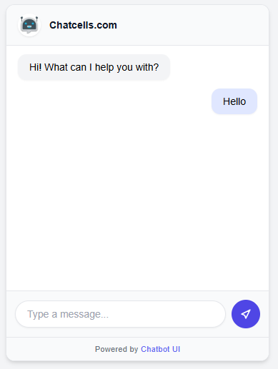
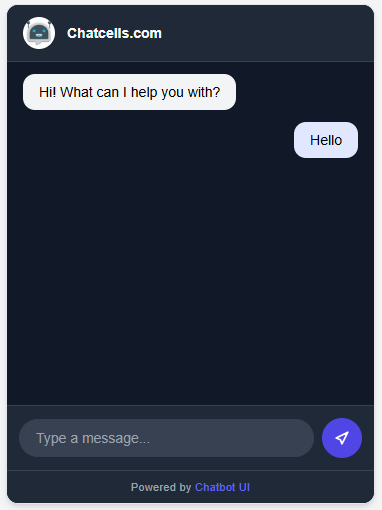
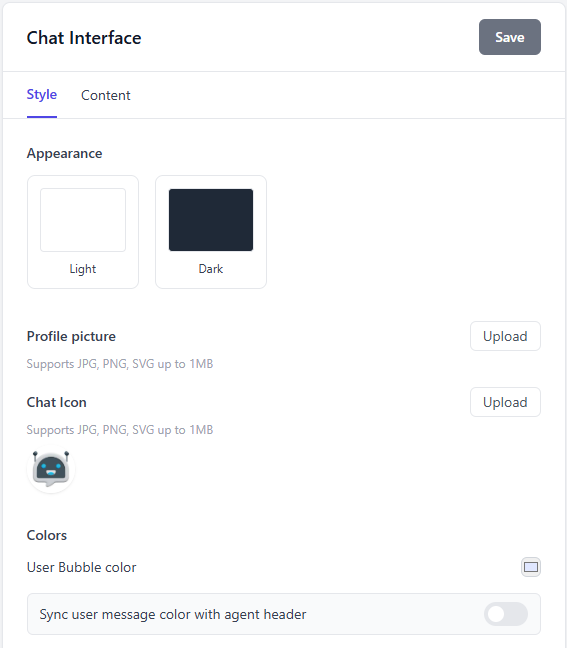
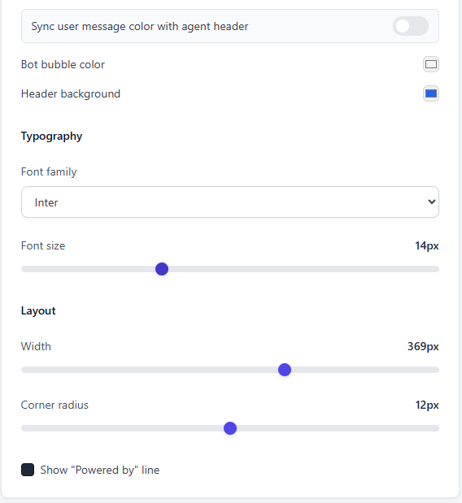

# Chatbot UI — Configurable Interface

This project is a **configurable chat widget** built as part of a hiring exercise.  
It allows users to preview and customize the chat interface in real time through a style/config panel.  

---

## 🚀 Tech Stack
- **ReactJS** (with Hooks & functional components)  
- **TailwindCSS** (for styling, responsive layout, and modern UI)  

---

## ⚡ Features

### 🖼 Chat Window
- Header with site/app name + chat icon or profile picture  
- Scrollable message area with user & bot messages  
- Composer area: input box + send button  
- “Powered by” line (toggleable in style panel)  

### 🎨 Style Panel
- **Appearance**: Light/Dark mode toggle  
- **Branding**: Upload profile picture & chat icon  
- **Colors**: User bubble, Bot bubble, User text, Bot text, Header background, Chat area background, Bubble radius  
- **Typography**: Font size (12–18px), Font family (Inter, Roboto, Georgia, etc.)  
- **Layout**: Widget width (280–420px), Corner radius (0–24px)  
- **Behavior**:  
  - Sync user bubble color with header  
  - Show/Hide “Powered by” line  

### ♿ Accessibility
- Fully keyboard accessible (Tab focus navigation)  
- Press **Enter** to send a message  
- Visible focus rings for interactive elements  
- Automatic **contrast warning** if text/background ratio < 4.5:1  

---

## 📦 Installation & Running

Clone the repo and install dependencies:

```bash
git clone https://github.com/your-username/chatbot-ui.git
cd chatbot-ui
npm install
npm start
```


---

## 🗂️ Project Structure

chatbot-ui/
 ├─ public/
 │   ├─ favicon.ico
 │   └─ manifest.json
 ├─ screenshots/
 │   ├─ chat-dark.png
 │   ├─ chat-light.png
 │   └─ style-panel.png
 ├─ src/
 │   ├─ components/
 │   │   ├─ ChatWidget.jsx
 │   │   ├─ StylePanel.jsx
 │   ├─ utils/
 │   │   └─ contrast.js
 │   ├─ App.css
 │   ├─ App.js
 │   ├─ index.css
 │   └─ index.js
 ├─ .gitignore
 ├─ package.json
 ├─ tailwind.config.js
 ├─ postcss.config.js
 └─ README.md

---

## 📸 Screenshots

### Chat Widget (Light Mode)
<<<<<<< HEAD

=======

>>>>>>> 078898fdc589410fed77ff58f34ba53f9fb9f0b2

### Chat Widget (Dark Mode)


### Style Panel



---

## 👨‍💻 Author

- **Your Name**  
- GitHub:  [github](https://github.com/Vikasprajapat1602)

<<<<<<< HEAD
---
=======
---
=======
>>>>>>> 078898fdc589410fed77ff58f34ba53f9fb9f0b2
